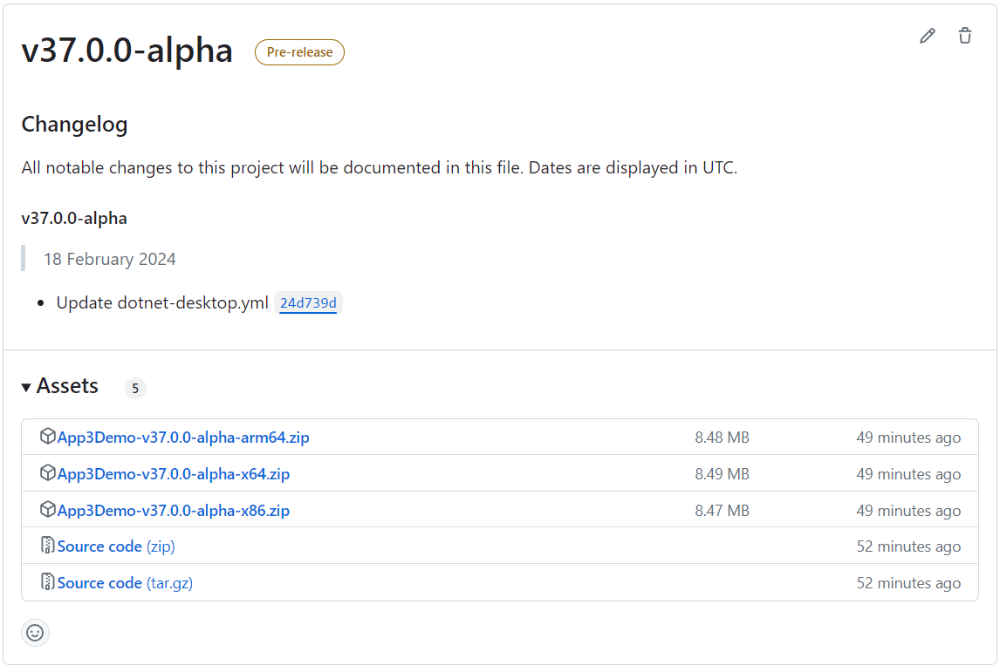

# Dotnet-Publish-Action
Publish your dotnet app (WinUI 3, WPF, Console) as a zip file with auto changelog in Github Release with Github Action.

## How to use?
- Download yml file into your repo and `./github/workflow` folder.
- Edit yml file and Config Options:

> **_NOTE:_**  currently we build your dotnet app with `dotnet-version: 8.0.x`

### Configuring Project
- PROJECT_PATH: `App1/App1.csproj`
- APP_NAME: `MyApp`

### Check Tag
if you set to `true`, before creating a new tag, we can check to see if tag exist, we go to next step, but if tag is not exsist, then we create a new tag.
if you set this to `false`, we dont check it. so if tag already exist, workflow will be terminated.

- CHECK_TAG_EXISTENCE_BEFORE_CREATING_TAG: `false`


### Custom Nuget Source
you can add your nuget sources.

- IS_COMMUNITY_TOOLKIT_NUGET_SOURCE_ENABLED: `false`
- IS_CUSTOM_NUGET_SOURCE_ENABLED: `false`
- CUSTOM_NUGET_SOURCES: '' # Example ('https://api.nuget.org/v3/index.json, https://api.nuget.org/v2/index.json,...')

> **_NOTE:_**  if you enable `IS_COMMUNITY_TOOLKIT_NUGET_SOURCE_ENABLED` following CommunityToolkit sources will be added.

```
CommunityToolkit-Labs: https://pkgs.dev.azure.com/dotnet/CommunityToolkit/_packaging/CommunityToolkit-Labs/nuget/v3/index.json
CommunityToolkit-Main: https://pkgs.dev.azure.com/dotnet/CommunityToolkit/_packaging/CommunityToolkit-MainLatest/nuget/v3/index.json
```   

### Configuring Dotnet Build Commands
- PUBLISH_OUTPUT_FOLDER: `publish`
- PUBLISH_SELF_CONTAINED: `false`
- PUBLISH_SINGLE_FILE: `false`
- PUBLISH_READY_TO_RUN: `false`
- PUBLISH_TRIMMED: `false`
- PUBLISH_TRIM_MODE: `partial`
- PUBLISH_AOT: `false`

> **_NOTE:_**  Use the `PUBLISH_TRIM_MODE` property to set the trimming granularity to either `partial` or `full`.

> **_NOTE:_** `PUBLISH_AOT` currently support only `Console` App.

### Configuring GitHub Release
- IS_PRE_RELEASE: `false`
- SKIP_IF_RELEASE_EXIST: `true`
- MAKE_LATEST: `true`
- ALLOW_UPDATES: `false`
- ARTIFACT_ERRORS_FAIL_BUILD: `false`

if you set a suffix (beta, alpha, preview, experimental) for version tag in your csproj file, `IS_PRE_RELEASE` will be changed to `true` based on suffix.

```xml
<Version>1.0.0-beta1</Version>
```

### Platform
if you want to build your app for x64 and x86 only, you can change platform:

platform: `[x64, x86]`

or if you want x64 only:

platform: `[x64]`

## WinUI 3
there is a knonw issue for WinUI 3, if you are using Class Library in your project, you should add following code into your class library csproj file:

```xml
<EnableMsixTooling>true</EnableMsixTooling>
```

Otherwise, the build will fail.

### Solution
for fixing this, we passed `/p:GITHUB_ACTIONS=true` property into dotnet publish command.

now you can use a `Directory.Build.props` file in your project root folder with following Content:

```xml
<PropertyGroup Condition="'$(GITHUB_ACTIONS)' == 'true'">
    <EnableMsixTooling>true</EnableMsixTooling>
</PropertyGroup>
```

This way, when you are using github action, all your projects will include `EnableMsixTooling`, And the build/publish will be done successfully.

---

